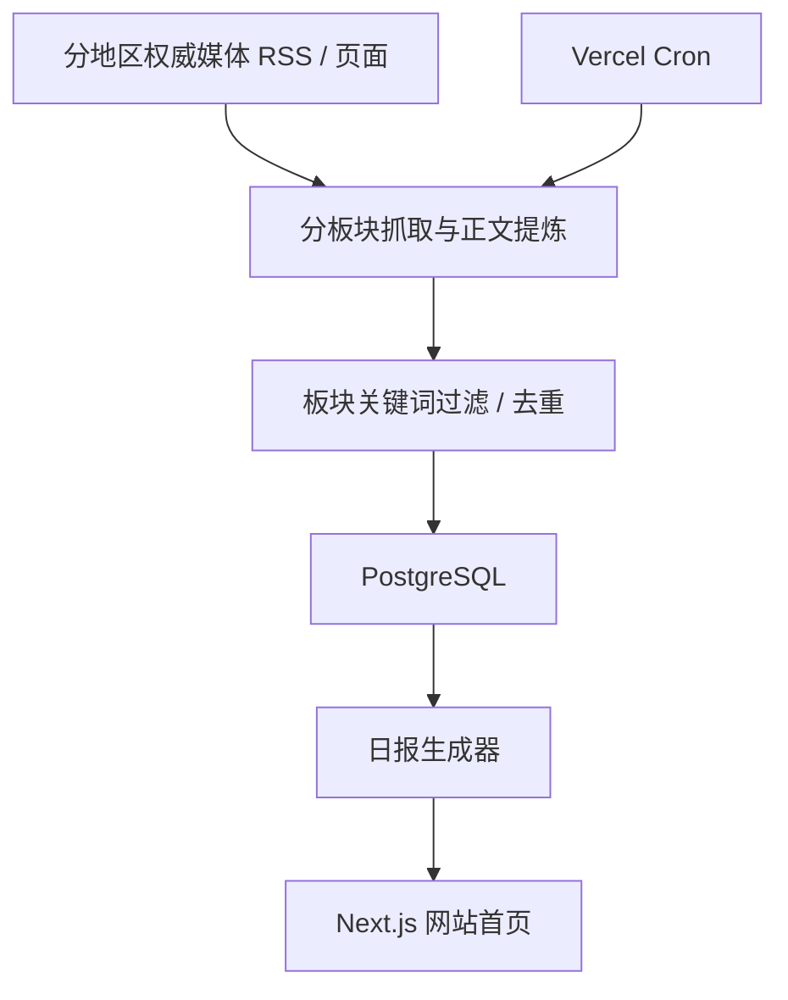

# 国际时政日报网站 MVP

一个面向手机和桌面浏览器的“国际时政日报”网站雏形。首页直接展示过去 24 小时内的日报，后台通过定时任务自动抓取、筛选并生成四个独立板块的简洁摘要。

## 架构方案

推荐用一套适合快速上线、后续也容易扩展的全栈 Web 架构：



### 前端

- 使用 Next.js App Router 做移动端优先的网站首页。
- 首页直接展示“今日国际时政日报”。
- 固定分成四个板块：欧盟、美国、东盟、匈牙利选举。
- 使用服务端渲染读取最新日报，保证首屏打开就能看。

### 后端

- 仍然使用 Next.js Route Handlers 提供后端接口，减少前后端分离的部署复杂度。
- `/api/cron/daily` 作为定时更新入口。
- `/api/brief/latest` 提供最新日报 JSON，方便后续接 App、小程序或管理后台。
- 新闻源、板块关键词、屏蔽词和权威等级都放在代码配置中，便于持续调整。

### 数据库

- PostgreSQL 负责持久化存储，适合部署到公网环境。
- `Article` 存储抓取后的新闻条目、板块归属和摘要结果。
- `DailyBrief` 存储每日生成的一期日报。
- `DailyBriefItem` 负责日报和新闻条目的排序关系。

### 定时任务

- 推荐用 Vercel Cron 每天早上自动调用 `/api/cron/daily`。
- 当前示例默认在北京时间 07:00 触发，对应 UTC `23:00`。
- 后续也可以替换成 GitHub Actions、Railway Cron 或云函数定时器。

## 为什么选这套技术栈

- `Next.js 15 + React 19`：前端页面和后端接口在一个项目里，最适合 MVP 快速上线。
- `Prisma + PostgreSQL`：数据模型清晰，后续切换到 Neon、Supabase、Railway Postgres 都方便。
- `Vercel`：部署网站最省心，手机浏览访问也最直接。
- `Vercel Cron`：不需要你每天手动执行命令，部署后自动更新。

这套组合特别适合你当前的目标：先做出一个真正能上线访问的网站，而不是停留在本地脚本。

## 数据源策略

MVP 当前按四个互不重叠的板块组织内容：

- 东盟：`CNA Asia`、`Bangkok Post`、`The Jakarta Post`、`The Straits Times`
- 美国：`The New York Times Politics`、`The Washington Post Politics / World`
- 欧洲：`Le Monde`、`Der Spiegel International`、`POLITICO Europe`、`The Guardian Europe`
- 匈牙利选举：从 `POLITICO Europe`、`The Guardian Europe / World` 等欧洲主流媒体中按关键词聚合

设计原则：

- 默认只取过去 24 小时内容
- 四个板块分别使用独立关键词池，不互相重叠
- 欧盟板块只看欧盟相关议题，不混入匈牙利选举
- 匈牙利板块只看匈牙利选举与竞选动态
- 尽量排除娱乐、体育、纯商业行情、无关社会新闻
- 同事件自动去重，避免日报被同题材刷屏
- 摘要优先参考正文段落，而不是只靠 RSS 导语

## 本地开发

1. 安装依赖

```bash
npm install
```

2. 配置环境变量

```bash
cp .env.example .env
```

3. 初始化数据库结构

```bash
npm run db:push
```

4. 启动开发环境

```bash
npm run dev
```

5. 手动触发一次日报抓取

```bash
curl -X POST http://localhost:3000/api/cron/daily \
  -H "Authorization: Bearer YOUR_CRON_SECRET"
```

## 公网部署方案

### 推荐方案：Vercel + Neon Postgres

1. 把代码推到 GitHub。
2. 在 Vercel 导入项目。
3. 创建一个 Neon Postgres 数据库。
4. 在 Vercel 配置环境变量：
   - `DATABASE_URL`
   - `CRON_SECRET`
   - `SITE_URL`
   - `BRIEF_TIMEZONE`
5. 部署后执行一次 `prisma db push`。
6. Vercel 会按 `vercel.json` 自动创建定时任务。

完成后：

- 你会得到一个公网 URL。
- 电脑和手机浏览器都能直接访问。
- 网站每天早上自动刷新当日国际时政日报。

更完整的部署说明见：

- [DEPLOY.md](/Users/chenzhixiang/Desktop/codex/DEPLOY.md)

## 当前 MVP 范围

已覆盖的能力：

- 网站首页日报展示
- 移动端优先 UI
- 四板块编排
- 权威来源配置
- 过去 24 小时抓取窗口
- 板块关键词筛选
- 去重
- 自动生成日报
- 定时任务入口

后续适合扩展的方向：

- 管理后台配置新闻源和关键词
- 多语言摘要
- 更强的跨来源同事件聚类
- 手动审核和置顶
- 邮件或 Telegram 推送
